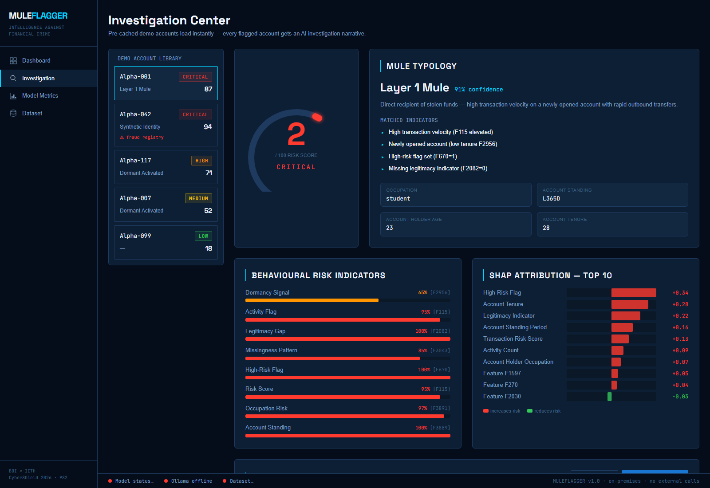
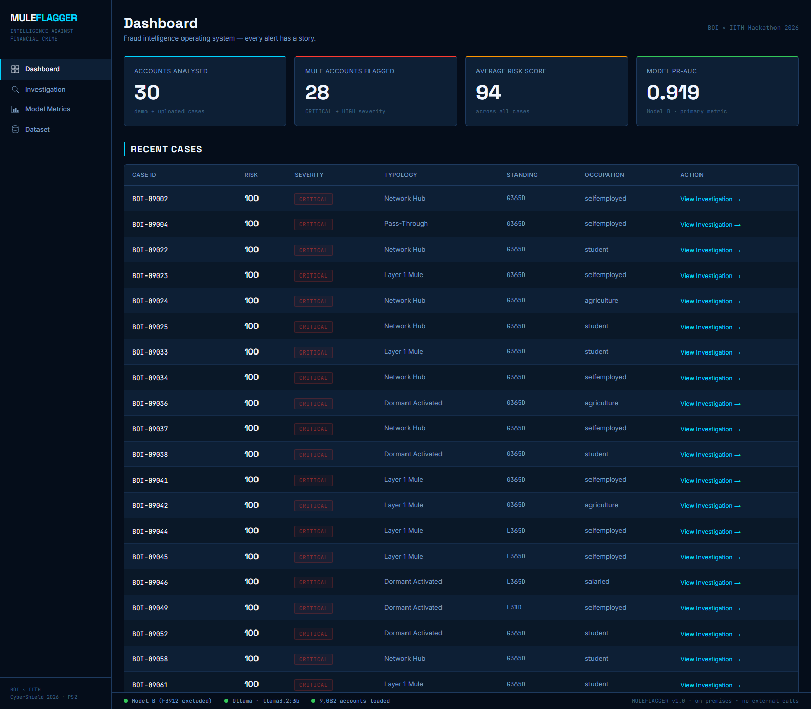
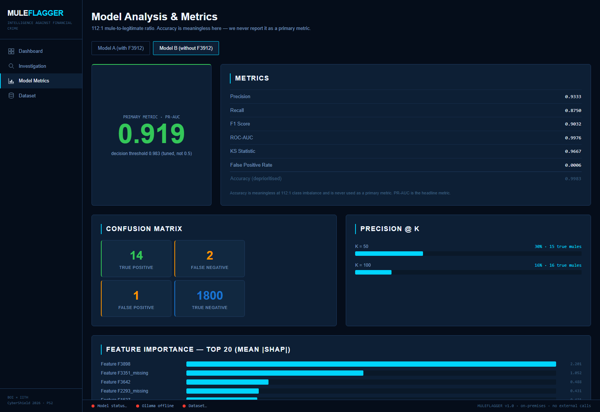
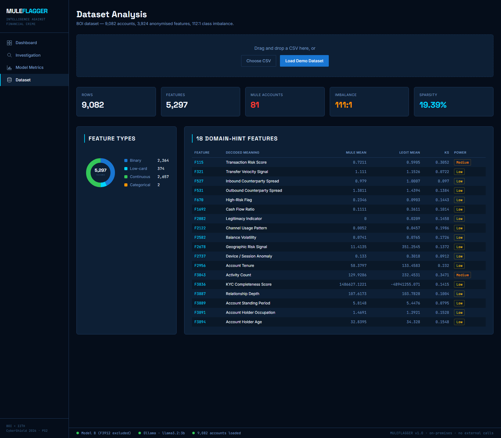
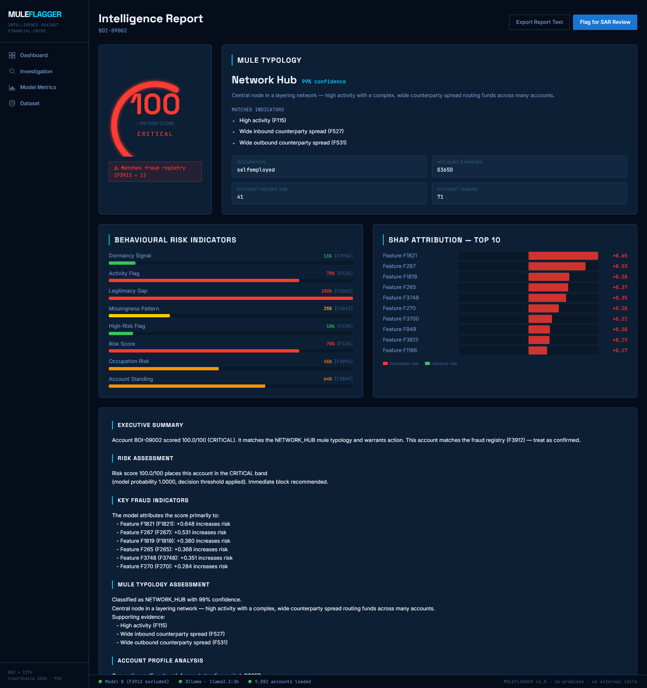

<div align="center">

# 🛡️ MULEFLAGGER

### Intelligence Against Financial Crime

**An AI-powered mule-account detection & suspicious-transaction classification platform for Indian banks.**

Built for the **Bank of India × IIT Hyderabad — CyberShield Hackathon 2026** · Problem Statement 2
*(AI/ML Classification of Suspicious Mule Accounts)*


</div>

---

> **MULEFLAGGER is not a fraud classifier — it is a fraud-intelligence operating system.**
> Every decision is explainable. Every alert has a story. Every flagged account gets an
> AI-generated investigation narrative — produced by a **local** LLM, with **zero external API calls** at runtime.

<div align="center">



</div>

---

## Table of contents

- [The problem](#the-problem)
- [What MULEFLAGGER does](#what-muleflagger-does)
- [Results](#results)
- [The F3912 leakage story](#the-f3912-leakage-story)
- [Screenshots](#screenshots)
- [Architecture](#architecture)
- [Tech stack](#tech-stack)
- [Getting started](#getting-started)
- [Demo flow for judges](#demo-flow-for-judges)
- [API reference](#api-reference)
- [Project structure](#project-structure)
- [Security & privacy](#security--privacy)
- [Documentation](#documentation)

---

## The problem

Mule accounts are the laundering rails of digital financial crime — ordinary-looking
accounts recruited (or synthetically created) to receive and forward stolen funds.
Detecting them is a **needle-in-a-haystack** problem:

- **9,082 accounts**, **3,924 anonymised features** (`F1`–`F3924`)
- A binary target `F3924` (1 = mule, 0 = legitimate)
- **112 : 1 class imbalance** — only **81 mules** in the entire dataset
- **27.6 % missing values**, including **63 fully-null columns**

A model that flags *nobody* scores **99.1 % accuracy** while catching **zero mules**.
MULEFLAGGER is built around that reality: it optimises for **PR-AUC**, treats *missingness
as signal*, explains every verdict, and is honest about feature leakage.

---

## What MULEFLAGGER does

| Capability | How |
|------------|-----|
| 🎯 **Detects mules** | XGBoost with `scale_pos_weight=112`, SMOTE-in-fold 5-CV, PR-curve threshold tuning |
| 📊 **Scores risk 0–100** | Threshold-anchored mapping → CRITICAL / HIGH / MEDIUM / LOW bands with recommended actions |
| 🔍 **Explains every decision** | SHAP `TreeExplainer` top-10 waterfall + 8 behavioural risk indicators |
| 🏷️ **Classifies typology** | 5 mule typologies (Layer-1, Pass-Through, Dormant-Activated, Synthetic-Identity, Network-Hub) |
| 📝 **Writes the report** | A 7-section investigation narrative via local Ollama (graceful deterministic fallback) |
| ⚖️ **Stays honest** | Trains **two** models to expose the F3912 leakage feature |
| 🔒 **Runs offline** | All ML + LLM inference on-premises. No API keys. SHA-256 on every upload. |

---

## Results

Evaluated on a **held-out 20 % stratified test split** the model never saw during
training, feature selection, or threshold tuning:

| Model | F3912 | **PR-AUC** *(primary)* | ROC-AUC | Precision | Recall | F1 | KS |
|-------|:-----:|:----------------------:|:-------:|:---------:|:------:|:--:|:--:|
| **Model A** | ✅ included | **1.000** | 1.000 | 1.000 | 1.000 | 1.000 | 1.000 |
| **Model B** *(production)* | ❌ excluded | **0.919** | 0.998 | 0.933 | 0.875 | 0.903 | 0.967 |

> **Why two numbers?** Model A's perfect score is the *leakage tell*. Model B is the
> honest, deployable result — and the default everywhere in the app.

**Confusion matrix (Model B, test split):** TP = 14 · FP = 1 · FN = 2 · TN = 1,800
→ **93 % precision at 87.5 % recall** on a 112 : 1 problem. The full-dataset pipeline
flags **80 of 81 mules**.

> ⚠️ **Accuracy is never reported as a primary metric.** At 112 : 1 it is meaningless;
> the Metrics page shows it only with an explicit warning.

---

## The F3912 leakage story

`F3912` has ~**96.3 % precision** for mules and is the **#1 feature by mutual information**
in the entire dataset — the textbook signature of a **post-labelling leakage feature**
(one that is only populated *after* an account is confirmed fraudulent).

A naive submission would include it and report a perfect score. MULEFLAGGER instead
**trains both models and shows the gap**:

- **Model A** keeps F3912 → PR-AUC **1.000** (presented with a leakage warning banner).
- **Model B** drops F3912 entirely before feature selection → PR-AUC **0.919** (production).

Demonstrating that we *understand* the data — rather than reporting an inflated number —
is the project's core intellectual-honesty statement.

A related finding: the engineered **missingness indicators** (`F3043_missing`, etc.)
routinely surface in the top SHAP importances, confirming the thesis that in this
dataset, *what is absent* discriminates mules as strongly as *what is present*.

---

## Screenshots

| Dashboard | Model Metrics |
|:---:|:---:|
|  |  |
| **Dataset Analysis** | **Intelligence Report** |
|  |  |

The **risk gauge** (animated SVG arc), **SHAP waterfall**, and **behavioural-indicator bars**
are all hand-built in SVG/CSS — no charting library.

---

## Architecture

```
 React 18 + TypeScript + Vite + Tailwind   (:3000)
        │   proxies /api ───────────────►   FastAPI + Uvicorn   (:8000)
                                                  │
        ┌──────────────────┬──────────────────────┼─────────────────────┐
   analyzers/          engines/                 ai/                  database/
   dataset_loader      model_engine (XGB A/B)   ollama_client        case_store
   feature_engineer    risk_engine              report_generator     (JSON)
   dataset_stats       classification_engine          │
                       shap_engine                     ▼
                       validation_engine        Ollama (:11434)
                       investigation_cache      llama3.2:3b / qwen3:8b
                                                NO EXTERNAL CALLS
```

**Data flow:** `CSV → load & clean → MI feature selection → XGBoost A/B → risk score →
SHAP + typology → AI report → persisted case`. See
[`docs/system-architecture.md`](docs/system-architecture.md).

---

## Tech stack

**Backend** — FastAPI · Uvicorn · Pydantic v2 · pandas · scikit-learn · XGBoost ·
SHAP · imbalanced-learn · httpx
**Frontend** — React 18 · TypeScript · Vite · Tailwind CSS *(SVG/CSS visuals, no chart lib)*
**AI** — Ollama (local `llama3.2:3b`, fallback `qwen3:8b`)

---

## Getting started

> **Prerequisites:** Python **3.11+** (native CPython, not MSYS2/MinGW), Node **18+**, and
> [Ollama](https://ollama.com). The platform also runs without Ollama — reports fall back
> to a deterministic structured narrative.

### 1 · AI layer

```bash
ollama serve
ollama pull llama3.2:3b        # ~2 GB · fast default (qwen3:8b is the auto-fallback)
```

### 2 · Backend

```bash
cd backend
python -m venv venv
source venv/bin/activate                 # Windows: venv\Scripts\Activate.ps1
pip install -r requirements.txt

python -m app.engines.model_engine        # pre-trains Model A + B (~3 min)
python -m app.engines.investigation_cache # pre-builds the 5 demo accounts
uvicorn app.main:app --port 8000
```

### 3 · Frontend

```bash
cd app
npm install
npm run dev
```

Open **http://localhost:3000** · interactive API docs at **http://localhost:8000/docs**.

> **The BOI dataset (`datasets/boi_dataset.csv`, ~112 MB) is not in this repo** — it
> exceeds GitHub's 100 MB file limit. Place the hackathon `DataSet.csv` at
> `datasets/boi_dataset.csv` before training. `datasets/labels_reference.csv`
> (ground-truth labels) **is** included.
>
> **Windows tip:** set `PYTHONUTF8=1` if a self-test hits a console-encoding error.

---

## Demo flow for judges

1. **Dashboard** — KPI cards (accounts analysed, mules flagged, avg risk, **PR-AUC 0.919**) and the recent-cases table.
2. **Investigation** — click **Alpha-001** → an instant CRITICAL *Layer-1 Mule* with risk gauge, SHAP waterfall, behavioural indicators, and an AI report. **Alpha-042** matches the fraud registry (`F3912 = 1`).
3. **Metrics** — PR-AUC as the headline; toggle **Model A** to see the leakage warning; accuracy is shown deprioritised.
4. **Dataset** — *Load Demo Dataset* and watch the **6-stage pipeline** process 9,082 accounts live; inspect the 18 domain-hint features table.

The 5 demo accounts load **instantly from cache** — no upload required.

---

## API reference

| Method | Endpoint | Purpose |
|--------|----------|---------|
| `GET`  | `/api/health` | Model, Ollama & dataset status |
| `POST` | `/api/analyze/dataset` | Upload a CSV → run the staged pipeline |
| `GET`  | `/api/analyze/status/{job_id}` | Poll pipeline progress |
| `POST` | `/api/analyze/account` | Analyse a single account feature dict |
| `GET`  | `/api/cases` · `/api/cases/{id}` | List / fetch cases |
| `GET`  | `/api/investigation` · `/api/investigation/{id}` | Demo library / cached investigation |
| `GET`  | `/api/metrics` | Model A & B validation metrics |
| `GET`  | `/api/dataset/stats` | Descriptive stats + 18 domain-hint table |

---

## Project structure

```
MULEFLAGGER/
├── app/                  React + TypeScript + Vite + Tailwind frontend
│   └── src/
│       ├── api/          Typed API client + response interfaces
│       ├── components/   RiskGauge · ShapWaterfall · BehaviouralBars · SarModal · …
│       └── pages/        Dashboard · Investigation · Metrics · Dataset · Report
├── backend/
│   ├── app/
│   │   ├── analyzers/    dataset_loader · feature_engineer · dataset_stats
│   │   ├── engines/      model · risk · classification · shap · validation · cache
│   │   ├── ai/           ollama_client · report_generator
│   │   ├── routes/       health · analyze · cases · metrics · investigation · dataset
│   │   ├── models/       Pydantic schemas (API contracts)
│   │   ├── database/     JSON case store
│   │   └── main.py
│   ├── cache/            Pre-trained models, metrics, demo cache
│   └── requirements.txt
├── datasets/             boi_dataset.csv (not in git) · demo_accounts/ · labels_reference.csv
├── docs/                 architecture · technical-design · how-to-run · screenshots
└── uploads/              Runtime CSV intake (SHA-256 recorded)
```

Every analyzer/engine ships a standalone self-test: `python -m app.engines.<name>`.

---

## Security & privacy

- **No external calls at runtime** — all ML inference and LLM generation are on-premises.
- **Ollama is local** — no account data ever leaves the host.
- **SHA-256** recorded for every uploaded dataset; uploads confined to `uploads/`.
- **No API keys** required or stored. Fully functional offline once dependencies install.
- Designed to run inside an **air-gapped bank security operations network**.

---

## Documentation

- 📐 [`docs/system-architecture.md`](docs/system-architecture.md) — components, data flow, security boundaries
- 🔬 [`docs/technical-design.md`](docs/technical-design.md) — risk engine, typology rules, SHAP, F3912 leakage, the 112:1 strategy
- 🚀 [`docs/how-to-run.md`](docs/how-to-run.md) — full setup, self-tests, troubleshooting

---

<div align="center">

**MULEFLAGGER** · XGBoost (Model B) · SHAP-attributed analysis · local Ollama
Built for **BOI × IITH CyberShield Hackathon 2026** · Problem Statement 2

</div>
